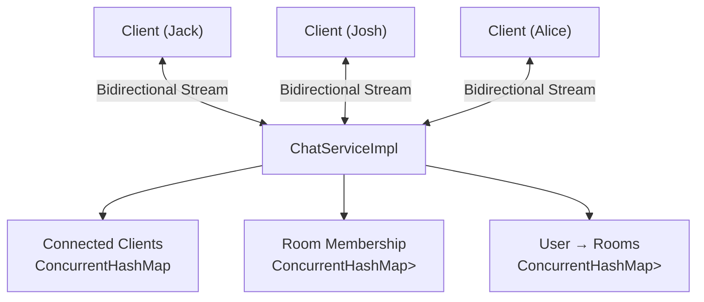

# gRPC-chat-app


A terminal-based chat application built to learn **gRPC from first principles**.

Rather than starting directly with a chat application, the project first implements all four gRPC communication patterns—Unary, Server Streaming, Client Streaming, and Bidirectional Streaming—and then applies those concepts to build a real-time multi-client chat system.

The final application demonstrates how bidirectional streaming can be used to maintain long-lived client connections while supporting global messaging, private messaging, and room-based communication.

---

# Motivation

The goal of this project was to understand:

- How gRPC maintains persistent streams
- When to use blocking vs asynchronous stubs
- How StreamObservers communicate in both directions
- How multiple clients can be managed concurrently
- How real-time routing can be built using bidirectional streaming

Instead of isolated examples, these concepts are combined into a working chat application.

---

# Features

## gRPC Learning

- Unary RPC
- Server Streaming RPC
- Client Streaming RPC
- Bidirectional Streaming RPC

## Chat System

- Multi-client communication
- Global chat
- Private messaging
- Multiple chat rooms
- Join / Leave rooms
- Active room switching
- One-off room messaging
- Duplicate username detection
- Join / Leave notifications
- Graceful client cleanup

---

# Architecture



Each client establishes a long-lived bidirectional stream with the server.

The server keeps a `StreamObserver` for every connected client, allowing it to push messages without the client issuing a new request.

Incoming messages are routed based on their type:

- Global broadcasts
- Private messages
- Room messages
- System notifications

---

# Project Structure

```text
grpc-chat-app
│
├── src
│   └── main
│       ├── java
│       │   └── com.chat
│       │       ├── client
│       │       │   └── ChatClient.java
│       │       ├── server
│       │       │   └── ChatServer.java
│       │       └── service
│       │           └── ChatServiceImpl.java
│       │
│       └── proto
│           └── chat.proto
│
└── pom.xml
```

---

# Communication Patterns

## Unary RPC

```
Client
   │
Request
   │
Server
   │
Response
   │
Client
```

Used to understand the basic request-response lifecycle.

---

## Server Streaming

```
Client
   │
One Request
   │
Server
   │
Many Responses
   │
Client
```

Introduces blocking stubs and streaming iterators.

---

## Client Streaming

```
Client
   │
Many Requests
   │
Server
   │
One Response
   │
Client
```

Demonstrates asynchronous request streaming and response callbacks.

---

## Bidirectional Streaming

```
Client  ◄────────────► Server
```

Forms the foundation of the chat application.

Both client and server continuously exchange messages over the same stream.

---

# Message Routing

Every message contains a type that determines how the server processes it.

| Message Type | Description |
|--------------|-------------|
| JOIN | Register a client |
| CHAT | Global broadcast |
| PRIVATE | Direct message |
| ROOM_JOIN | Join room |
| ROOM_LEAVE | Leave room |
| ROOM_CHAT | Broadcast within a room |
| SYSTEM | Server notifications |

The server never parses user commands like:

```
@josh hello
#backend deployment finished
```

Instead, the client translates user input into structured protobuf messages before sending them to the server.

This keeps the networking protocol independent of the terminal interface.

---

# Chat Rooms

Users may belong to multiple rooms simultaneously.

The server maintains two mappings:

```
Room
 ↓
Users
```

and

```
User
 ↓
Rooms
```

This allows efficient routing as well as fast cleanup when a client disconnects.

An active room can be selected:

```
/switch backend
```

Messages are then automatically routed to that room.

A one-off override is also supported:

```
#gaming Anyone online?
```

without changing the active room.

---

# Running

Build

```bash
mvn clean compile
```

Run the server

```bash
ChatServer.java
```

Run one or more clients

```bash
ChatClient.java
```

---

# Example Session

```
Jack
----
/join backend
/switch backend

Hello everyone

Josh
----
/join backend

Output

[backend] Jack: Hello everyone
```

Private messaging

```
@josh Can you review this?
```

Output

```
[PRIVATE] Jack: Can you review this?
```

---

# Concepts Explored

- Protocol Buffers
- gRPC
- Bidirectional Streaming
- Asynchronous programming
- StreamObserver lifecycle
- Blocking vs Async stubs
- Thread-safe collections
- Client lifecycle management
- Message routing
- Room membership management

---

# Learning Outcomes

This project was built as a hands-on exploration of gRPC.

Starting from simple unary RPCs and progressing through each streaming model made it possible to understand how long-lived streams can be used to build real-time systems.

The final result is a functional terminal chat application that combines multiple communication patterns with concurrent client management and protocol-based message routing.